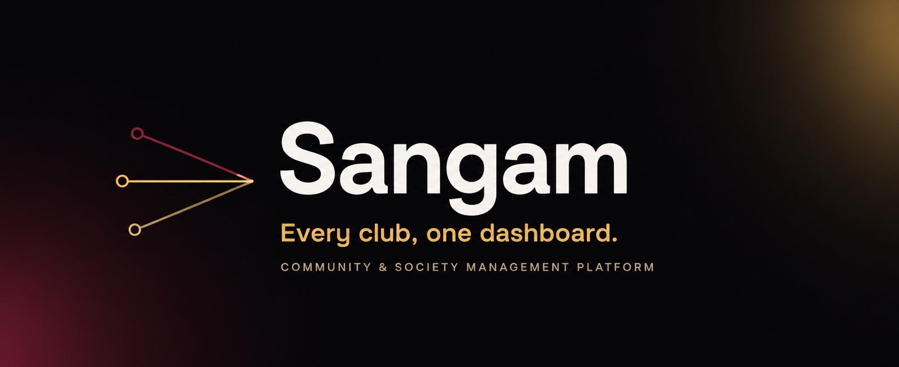

<p align="center">
  
</p>

Sangam is a community and society management platform: a single source of truth for membership, events, venues, equipment, tasks, and communication, built to replace the WhatsApp groups, Google Forms, and spreadsheets clubs typically end up patching together.

**Live demo:** [try-sangam.vercel.app](https://try-sangam.vercel.app). See [Demo accounts](#demo-accounts) to sign in.

---

## Contents

- [Features](#features)
- [Tech stack](#tech-stack)
- [Team](#team-dhurandhar-may2026-team-004)
- [Getting started](#getting-started)
- [Demo accounts](#demo-accounts)
- [Roles and access](#roles-and-access)
- [API docs](#api-docs-openapi--swagger)
- [Testing](#testing)
- [Project structure](#project-structure)
- [Data model](#data-model)
- [Deployment](#deployment)
- [License](#license)

---

## Features

- **Role-based dashboards**: separate, purpose-built views for Admin, Coordinator, Volunteer, Member, and Faculty, each showing only what that role needs to act on.
- **Membership management**: join requests, bulk CSV member import, per-club roles instead of one global permission level.
- **Events lifecycle**: creation, faculty approval, registration ("Count Me In") with race-safe capacity enforcement, check-in, and registration locking.
- **Issue tracking**: members raise issues with screenshot attachments; admins triage, filter, and assign them individually or in bulk.
- **Announcements**: audience-targeted broadcasts instead of blanket messages.
- **Transparency & metrics**: admin-facing club health and activity reporting.
- **Ask Sangam**: an in-app assistant (`POST /api/assistant/query`) for natural-language questions about club data.
- **Signed session auth**: custom httpOnly-cookie sessions with server-side role checks on every protected route, no client-trusted state.

---

## Tech stack

**Frontend**
- [Next.js 14](https://nextjs.org/) (App Router)
- [React 18](https://react.dev/)
- [TypeScript](https://www.typescriptlang.org/)
- [Tailwind CSS](https://tailwindcss.com/)
- [Motion](https://motion.dev/) for animation
- [Lucide](https://lucide.dev/) for icons

**Backend & data**
- [Prisma](https://www.prisma.io/) as ORM
- [PostgreSQL](https://www.postgresql.org/), hosted on [Neon](https://neon.tech/) (serverless Postgres), provisioned through the Vercel Postgres integration
- [Zod](https://zod.dev/) for schema validation
- [bcrypt](https://www.npmjs.com/package/bcrypt) for password hashing
- [Vercel Blob](https://vercel.com/storage/blob) for file storage

**Auth**
- A custom, signed httpOnly-cookie session (`backend/auth/session-cookies.ts`), not NextAuth. Real signup and login go through `app/api/auth/{signup,login,me}` and `backend/auth/*`. The NextAuth-shaped route at `app/api/auth/[...nextauth]/route.ts` is an unrelated stub kept for URL-shape compatibility; it plays no part in authentication.

**AI**
- [Anthropic Claude API](https://www.anthropic.com/api) powers Ask Sangam, the in-app assistant

**Testing**
- [Jest](https://jestjs.io/) with [Testing Library](https://testing-library.com/) for unit, component, and live-HTTP integration suites (see [Testing](#testing))

**Deployment**
- [Vercel](https://vercel.com/), built from `main` (see [Deployment](#deployment))

---

## Team, Dhurandhar (MAY2026-Team-004)

| Name | Project role |
|---|---|
| Alok Kumar Tripathi | Team Lead, Backend |
| Vishal Singh Baraiya | Product Manager |
| Pardhiv Nukasani | Frontend |
| Purnendu Shukla | Backend, Code Review |
| Yalla Ashish Chandra Reddy | Testing |

---

## Getting started

Requires Node 22.6+ and Docker.

```bash
git clone <repo-url>
cd sangam
npm install
cp .env.example .env
npm run db:up      # Postgres
npm run db:push    # applies the Prisma schema
npm run db:seed    # loads clubs, events, and the demo accounts below
npm run dev
```

The app runs at `http://localhost:3000`.

### Environment variables

Set these in `.env` (see `.env.example` for the full list with defaults):

| Variable | Purpose |
|---|---|
| `DATABASE_URL` | Postgres connection string, local or Neon. |
| `AUTH_SECRET` | Signs the session cookie. Required in production; the app refuses to start signing sessions without it. Falls back to a fixed insecure value in development. Generate one with `openssl rand -hex 32`. |
| `ALLOW_DEMO_SESSION` | Optional, development only. Enables the login page's role-preview shortcut, a privileged session with no sign-in required. Never set this in production; protected routes fall back to it only when it's explicitly on. |
| `ANTHROPIC_API_KEY` | Powers Ask Sangam (`POST /api/assistant/query`) via `lib/genai.ts`. Get a key at [console.anthropic.com](https://console.anthropic.com/). |

---

## Demo accounts

Log in with any of these at [try-sangam.vercel.app/login](https://try-sangam.vercel.app/login) (or locally at `/login`). They're created by `prisma/seed.ts`.

**All-in-one account.** One person, every role at once (Admin on CodeChef, Coordinator on E-Cell, Volunteer on Sarga, Member on Paradox, plus Faculty), so you can switch roles from the sidebar without signing in as five different people:

| Email | Password |
|---|---|
| 23s1000123@ds.study.iitm.ac.in | sangam |

**Single-role accounts** (password `FirstName@2026`), each pinned to exactly one role. Useful for testing that role-gating and cross-club authorization actually hold:

| Name | App role | Email | Password |
|---|---|---|---|
| Alok Kumar Tripathi | Faculty | 23f3003225@ds.study.iitm.ac.in | Alok@2026 |
| Vishal Singh Baraiya | Admin | 23f2005593@ds.study.iitm.ac.in | Vishal@2026 |
| Pardhiv Nukasani | Volunteer | 23f3004115@ds.study.iitm.ac.in | Pardhiv@2026 |
| Purnendu Shukla | Coordinator | 22f2000147@ds.study.iitm.ac.in | Purnendu@2026 |
| Yalla Ashish Chandra Reddy | Member | 23f3003728@ds.study.iitm.ac.in | Ashish@2026 |

Roll numbers match the email's local part (e.g. `23f3003225`). Club roles: CodeChef (Admin), E-Cell (Coordinator), Sarga (Volunteer), Paradox (Member).

---

## Roles and access

Five roles: Admin, Event Coordinator, Club Member, Volunteer, Faculty Mentor. Role is per-club, not global: a `Membership` join table (`User` x `Club`) carries a `ClubRole`, so one person can be Coordinator of one club and a plain Member of another. Faculty is separate, an institution-wide `User.isFaculty` flag rather than a per-club role, since faculty oversight isn't scoped to a single club.

`/admin`, `/coordinator`, `/volunteer`, `/faculty`, and `/app` (member) each check the signed session cookie against the database and redirect to `/login` if you're not signed in as a user who actually holds that role. There's no bypass in production: an anonymous or forged request to any of these routes is turned away, not handed a privileged session.

---

## API docs (OpenAPI / Swagger)

Source of truth: `docs/openapi.yaml` (OpenAPI 3, Swagger-compatible). Served live at `/api/openapi` while the app is running.

| What | URL / path |
|---|---|
| Interactive docs (Try it out) | [http://localhost:3000/api-docs](http://localhost:3000/api-docs) |
| OpenAPI YAML (raw) | [http://localhost:3000/api/openapi](http://localhost:3000/api/openapi) |
| OpenAPI file in repo | `docs/openapi.yaml` |

### Trying an endpoint manually

1. Start the app: `npm run dev`
2. Open [http://localhost:3000/api-docs](http://localhost:3000/api-docs)
3. Expand an operation (e.g. `POST /api/auth/signup`), click **Try it out**, edit the example body, click **Execute**
4. Check **Server response** for the status code and JSON (documented response shapes live in the YAML)

Example signup body (institutional email only, `@ds.study.iitm.ac.in`):

```json
{
  "name": "Ananya Rao",
  "email": "23s1000999@ds.study.iitm.ac.in",
  "rollNumber": "23s1000999",
  "password": "SecurePass1"
}
```

A successful signup returns `201` with `success: true` and sets the session cookie.

### editor.swagger.io vs. local `/api-docs`

You can paste or load `docs/openapi.yaml` into [editor.swagger.io](https://editor.swagger.io/) to view or edit the spec.

**Don't rely on Execute there against `http://localhost:3000`.** The editor is served over HTTPS, so the browser blocks calls to plain HTTP localhost (mixed content) and Swagger shows something like "Undocumented, Failed to fetch." That's a browser limitation, not a broken API. CORS is enabled for `https://editor.swagger.io` on `/api/*`, but for reliable Try it out, use the local docs at [http://localhost:3000/api-docs](http://localhost:3000/api-docs) instead, since it shares an origin with the API.

---

## Testing

Everything runs on Jest. Three suites, split because they need different things to run:

### Unit tests

Pure logic in `lib/` and `backend/*` (formatters, auth-role helpers, workflow rules like `isEventPast`, Zod schemas). No server or database needed.

```bash
npm test
```

### Component tests

React components under `tests/components/`, run with `jsdom` via Testing Library. No server or database needed.

```bash
npm run test:components
```

### Integration tests (live HTTP)

Hits real Next.js route handlers over HTTP (`tests/integration/`), covering every REST endpoint under `app/api/`. The app and database both need to be running.

```bash
# Terminal 1: app + database
npm run db:up
npm run db:push
npm run db:seed
npm run dev

# Terminal 2: tests
npm run test:integration
```

Optional env var: `SANGAM_BASE_URL` (defaults to `http://localhost:3000`).

Role-scoped endpoints (coordinator, admin, faculty) authenticate as the matching seeded team account from [Demo accounts](#demo-accounts) rather than relying on the `ALLOW_DEMO_SESSION` shortcut, so the suite exercises the same session and authorization path a real user would hit. It also covers the concurrency fix behind event registration (ten genuinely simultaneous requests for one capacity slot, asserting exactly one winner) and the security-relevant paths: anonymous access to every protected route and API, a forged session cookie, cross-role authorization, and 404s for missing dynamic pages.

Written test-case docs, in the course-required format, live under `docs/test-cases/`.

### Quick smoke check without Swagger

With `npm run dev` running:

```bash
curl -s -X POST http://localhost:3000/api/auth/signup \
  -H "Content-Type: application/json" \
  -d '{"name":"Ananya Rao","email":"23s1000999@ds.study.iitm.ac.in","rollNumber":"23s1000999","password":"SecurePass1"}'
```

---

## Project structure

```
app/
  (public)/        landing, clubs directory, login, signup (+ interests onboarding)
  (member)/app/    dashboard, clubs (+ join requests), events (+ Count Me In), issues
                    (raise via modal + screenshot attachments, status filter), profile
                    (edit details + avatar upload, notification preference toggles)
  (admin)/admin/   overview, members (+ add member, bulk CSV import), issues
                    (filterable queue, per-row/bulk assignment), approvals, announcements
                    (+ audience targeting), metrics, transparency, handover
  (coordinator)/coordinator/  dashboard (+ New Event popup), all-events history, event
                    dashboard (registration, check-in, edit details), volunteers
  (volunteer)/volunteer/      task list with inline status updates, events (Count Me In)
  (faculty)/faculty/          oversight dashboard, event approvals, club activity
  api/auth/[...nextauth]/     unrelated stub, see Tech stack above
  api/openapi/                serves docs/openapi.yaml
  (public)/api-docs/          local Swagger UI (Try it out)

docs/
  openapi.yaml            Swagger-compatible OpenAPI 3 spec
  design.md                design notes
  testing-report.md        QA / testing writeup
  test-cases/              per-endpoint test case docs, course-required format

components/
  ui/          Btn, GlassCard, Stat, StatusPill, Modal, shared design-system primitives
  shell/       AppShell (per-role sidebar/nav), PageHeader
  auth/        AuthShell (shared login/signup visual shell), OnboardingForm
  tasks/       TaskStatusButtons, shared between the volunteer and coordinator task boards
  (route-local components, e.g. forms and list views specific to one page, live colocated
   next to their page.tsx inside app/, per Next.js convention, rather than under components/)

backend/                  server-only code, never imported by client components
  auth/
    mock-session.ts        the demo/role-preview session, see Environment variables above
    session-cookies.ts     signs and verifies the real session cookie
    authenticate-user.ts, create-user.ts, get-current-user.ts   auth domain logic shared
                            by both the REST routes (app/api/auth/*) and the form actions
    login-schema.ts, signup-schema.ts    zod schemas shared by both entry points
    roles.ts                helpers for reading a user's per-club role from the session
  api/
    http.ts                 jsonSuccess/jsonError response shape shared by REST routes
  db/
    prisma.ts                Prisma Client singleton
  domain/
    workflow-rules.ts        status enums and authorization rules (requireClubAdminAccess,
                              isEventPast, etc.)
    approvals.ts, countMeIn.ts, tasks.ts, events.ts, membership.ts   Server Actions and
                              domain logic shared across more than one route

lib/                      frontend-facing helpers, safe to import from client components
  seed-data.ts             static content not modeled as a DB table (landing-page copy, etc.)
  notification-prefs.ts    parse/default helpers for the profile's notification toggles
  interests.ts             parse/default helpers for signup interests and club recommendations
  event-tags.ts            parse/serialize helpers for comma-separated event tags
  format.ts                date/display formatting helpers
  utils.ts                 cn() class-name helper

prisma/
  schema.prisma            active schema
  migrations/, seed.ts

tests/
  unit/          Jest unit tests, mirrors the lib/ and backend/ source tree
  components/    Jest + Testing Library component tests (jsdom)
  integration/   Jest integration tests, live HTTP against app/api/ (needs a running app + database)
```

---

## Data model

Role is per-club, not global, as described in [Roles and access](#roles-and-access). Venues and Equipment are separate models, not a merged "Resource" type. The shape is shared exactly by `prisma/schema.prisma` and the live Postgres database via `backend/db/prisma.ts`.

---

## Deployment

Production runs on Vercel, built from `main`. The database is Neon Postgres, connected through the Vercel Postgres integration, which manages `DATABASE_URL` automatically. `AUTH_SECRET` is set directly in the Vercel project's environment variables. `ALLOW_DEMO_SESSION` is intentionally left unset in production, so the role-preview shortcut never activates there.

To point production at a fresh database: `npx prisma db push --schema=prisma/schema.prisma` against the new `DATABASE_URL`, then `npx tsx prisma/seed.ts` to load clubs, events, and the demo accounts.

---

## License

This project is licensed under the [MIT License](LICENSE).
