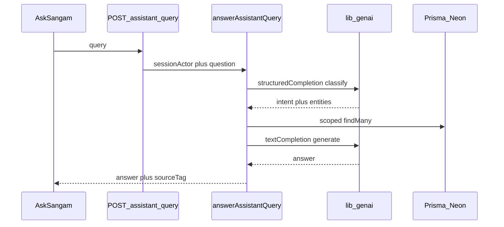
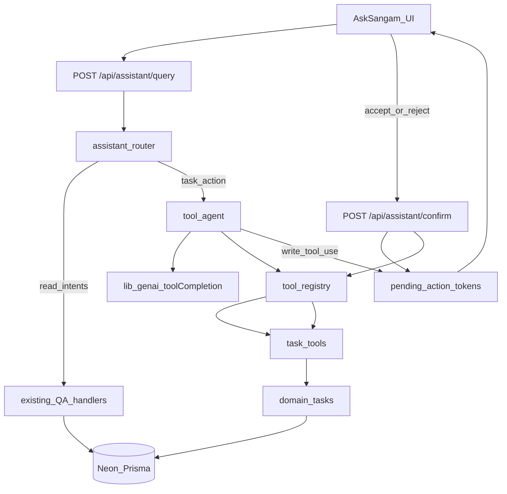
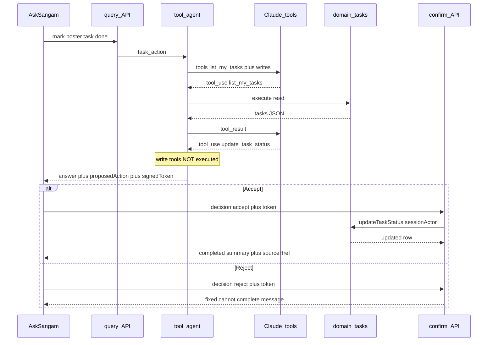

# Ask Sangam Task Tooling Layer

## Decisions locked

- **Transport:** In-process TypeScript tools + Anthropic Messages `tools` / `tool_use` (no MCP).
- **Scope (v1):** Task ops only — `list_my_tasks` (auto), `update_task_status` + `assign_task` (confirm first).
- **Routing:** Dual path — keep classify → Prisma → generate for Q&A; route **mutation** intents to a separate tool agent.
- **Pending store:** Signed HMAC token (reuse `AUTH_SECRET` pattern from [`backend/auth/cookie-signing.ts`](backend/auth/cookie-signing.ts)). No new Neon table for v1.
- **Modularity rule:** Domain never imports assistant/tools. Tools wrap domain. GenAI wrapper stays tool-agnostic. New domains later = new tool file + registry entry only.

## Current baseline (what we build on)



- [`backend/domain/assistant.ts`](backend/domain/assistant.ts): intents `event_lookup | task_lookup | announcement_lookup | membership_status | unrelated` — **read-only**.
- [`lib/genai.ts`](lib/genai.ts): `structuredCompletion` / `textCompletion` only — **no tools API yet**.
- [`backend/domain/tasks.ts`](backend/domain/tasks.ts): `updateTaskStatus(actor, …)` / `assignTask(actor, …)` already enforce assignee-or-coordinator auth against Prisma `Task` / `Event` / `Membership`.
- [`components/shared/AskSangam.tsx`](components/shared/AskSangam.tsx): single-shot JSON; no confirmation UI.
- Tests: [`tests/integration/assistant.test.ts`](tests/integration/assistant.test.ts) — live Claude + grounding/leak cases must keep passing on the Q&A path.

## Target architecture (modular layers)



### Module boundaries (no cohesion)

| Module | Responsibility | Must NOT know |
|--------|----------------|---------------|
| [`backend/domain/tasks.ts`](backend/domain/tasks.ts) | Authz + Prisma mutations | Claude, tools, UI, confirm tokens |
| `backend/assistant/tools/*` | Tool schemas, risk flags, call domain | Claude prompts, HTTP, UI |
| `backend/assistant/agent/*` | Tool loop + propose-vs-execute policy | Prisma details, specific task fields beyond tool args |
| [`lib/genai.ts`](lib/genai.ts) | Generic `messages.create` with `tools` | Task domain, registry contents |
| [`backend/domain/assistant.ts`](backend/domain/assistant.ts) | Classify + **dispatch only** | Tool implementations |
| API routes | Session + HTTP envelope | Tool business logic |
| `ToolProposalCard` UI | Accept/Reject presentation | Domain / Claude |

Dependency direction: **UI → API → router → (QA \| agent) → registry → tools → domain → Prisma**. Never reverse.

## Dual-path routing

Extend classifier intent enum with **`task_action`**:

- Keep `task_lookup` for “what’s on my task list?” (existing Q&A path unchanged).
- New `task_action` for “mark X done”, “set status to doing”, “assign … to …”.
- Classifier prompt gets clear examples so read vs write don’t collide.
- `answerAssistantQuery` switch: `task_action` → `runTaskToolAgent(user, question)`; all other intents unchanged.

## v1 tools

Defined in `backend/assistant/tools/task-tools.ts`, registered in `backend/assistant/tools/registry.ts`.

1. **`list_my_tasks`** — `risk: "read"`, `requiresConfirmation: false`  
   Returns open tasks for `actor.id` (title, id, status, event title, dueAt). Auto-runs inside the agent loop so Claude can resolve “that poster task” before proposing a write.

2. **`update_task_status`** — `risk: "write"`, `requiresConfirmation: true`  
   Args: `{ taskId, status: todo|doing|done }`. On Accept → `updateTaskStatus(actor, …)` + same `revalidatePath` set as [`updateTaskStatusAction`](backend/domain/tasks.ts).

3. **`assign_task`** — `risk: "write"`, `requiresConfirmation: true`  
   Args: `{ title, role, eventId, assigneeId }` matching existing `AssignTaskInput`. On Accept → `assignTask(actor, …)`. Only include this tool in the Claude tool list when the session has Coordinator/Admin membership (role-gated at registry filter time — not inside Claude).

## Propose / accept / reject flow



**Write policy:** When Claude emits `tool_use` for a `requiresConfirmation` tool, the agent:

1. Validates args with the tool’s Zod schema.
2. Builds a human-readable `summary` (e.g. “Mark task ‘Poster design’ as done”).
3. Signs payload `{ userId, toolName, args, exp }` with HMAC (`AUTH_SECRET`).
4. Returns immediately — **does not** call the domain write, **does not** continue the tool loop for that write.

**Confirm API** (`POST /api/assistant/confirm`):

- Body: `{ decision: "accept" | "reject", token: string }`.
- Verify signature, expiry (~5–10 min), and `payload.userId === session.user.id`.
- Reject → `{ answer: "Okay — I won't make that change." }` (or similar fixed copy).
- Accept → `registry.execute(toolName, actor, args)` → domain → revalidate → completion summary + `sourceType: "task"` + href to volunteer/coordinator board.

## Response / UI contract

Extend [`AssistantAnswer`](backend/domain/assistant-types.ts) (backward compatible):

```ts
proposedAction?: {
  toolName: string;
  summary: string;
  argsPreview: Record<string, string>; // display-safe
  token: string;
  status: "pending"; // UI may later show accepted/rejected locally
};
```

Existing Q&A responses omit `proposedAction` — current clients keep working.

**AskSangam UI** (per [`docs/design.md`](docs/design.md)):

- New `ToolProposalCard` (own component): `.night-panel`, mono tool/meta labels, `StatusPill` amber while pending.
- Accept: `.gold-cta` / `Btn primary`.
- Reject: `Btn outline`.
- On accept success: append assistant summary message + existing `SourceTag` for task; optionally refresh-friendly copy (“Done — you can confirm on your task board”).
- While a proposal is pending, disable sending another query for that card’s thread step (simple: `pendingAction` flag).

## `lib/genai.ts` addition

Add **`toolCompletion`** (or `messagesWithTools`):

- Inputs: `system`, `messages`, `tools` (Anthropic tool defs), `maxTokens`, timeout.
- Returns raw `content` blocks (`text` | `tool_use`) + `stop_reason`.
- Knows nothing about Sangam tools — agent maps registry → Anthropic shape.

Keep existing `structuredCompletion` / `textCompletion` untouched so Q&A and tests stay stable.

## Files to create / touch

**Create**

- `backend/assistant/tools/types.ts` — `AssistantTool`, risk, execute signature
- `backend/assistant/tools/registry.ts` — register, `toAnthropicTools(filter)`, `get(name)`, `execute`
- `backend/assistant/tools/task-tools.ts` — three tools wrapping domain
- `backend/assistant/agent/pending-action.ts` — sign / verify tokens
- `backend/assistant/agent/run-task-agent.ts` — Claude tool loop + propose policy
- `app/api/assistant/confirm/route.ts`
- `components/shared/ToolProposalCard.tsx`
- `tests/unit/backend/assistant/*` — registry, pending token, write-not-executed
- Extend / add integration cases for propose → accept → DB assert; reject → no DB change

**Modify**

- [`backend/domain/assistant.ts`](backend/domain/assistant.ts) — add `task_action` intent + dispatch
- [`backend/domain/assistant-types.ts`](backend/domain/assistant-types.ts) — `proposedAction` field
- [`lib/genai.ts`](lib/genai.ts) — `toolCompletion`
- [`app/api/assistant/query/route.ts`](app/api/assistant/query/route.ts) — pass through new field (no logic)
- [`components/shared/AskSangam.tsx`](components/shared/AskSangam.tsx) — render card + confirm fetch
- [`docs/openapi.yaml`](docs/openapi.yaml) — document `proposedAction` + `/api/assistant/confirm`
- Example questions for volunteer/coordinator: one mutation example each

**Do not modify for v1:** event/membership/announcement handlers; Prisma schema; MCP.

## Testing plan

1. **Unit:** token forge rejected; expired token rejected; wrong userId rejected; write tools never call Prisma in agent unit (mock registry); role filter hides `assign_task` for plain volunteers.
2. **Existing integration:** full [`assistant.test.ts`](tests/integration/assistant.test.ts) still green (Q&A path untouched).
3. **New integration (live Claude + DB):** volunteer “mark my … task as done” → 200 with `proposedAction` → Accept → task status `done` in Prisma → second Accept of same token fails; Reject leaves status unchanged.
4. **Manual local:** AskSangam drawer Accept/Reject styling against design tokens; board reflects change after revalidation.

## Out of scope (later, if v1 works locally + deployed)

- Event register / check-in / create event tools
- Real MCP server extraction (registry stays extractable)
- Streaming SSE tool traces
- Durable `AssistantPendingAction` table / audit log
- Replacing Q&A path with a single agent
